# Atlas Municipal — Saúde das Cidades

Painel web para explorar a **saúde fiscal, econômica e social de qualquer município brasileiro**: busque por nome ou código IBGE, abra o raio-x da cidade em abas, compare até 3 cidades lado a lado e navegue por estados e pelo panorama nacional.

[](LICENSE)


---

## 📸 Demonstração

### Panorama e exploração

| | |
|---|---|
| 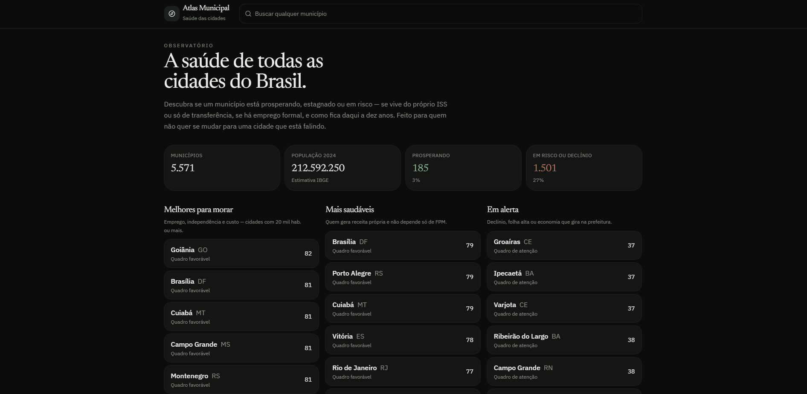 | 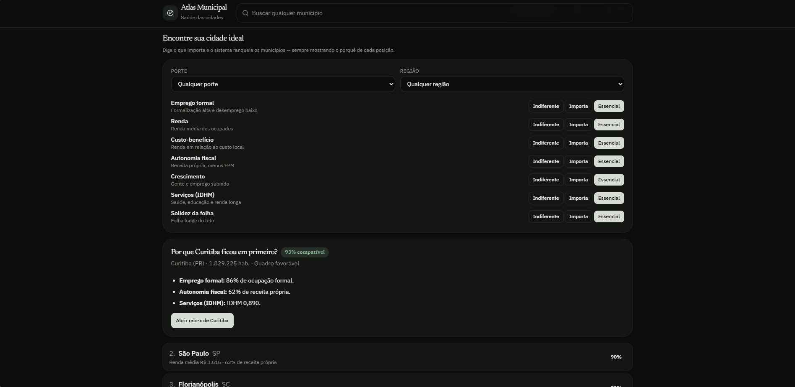 |
| **Panorama nacional** — municípios, população, quem prospera e quem está em alerta | **Encontre sua cidade ideal** — você diz o que importa e o app explica o ranking |
| 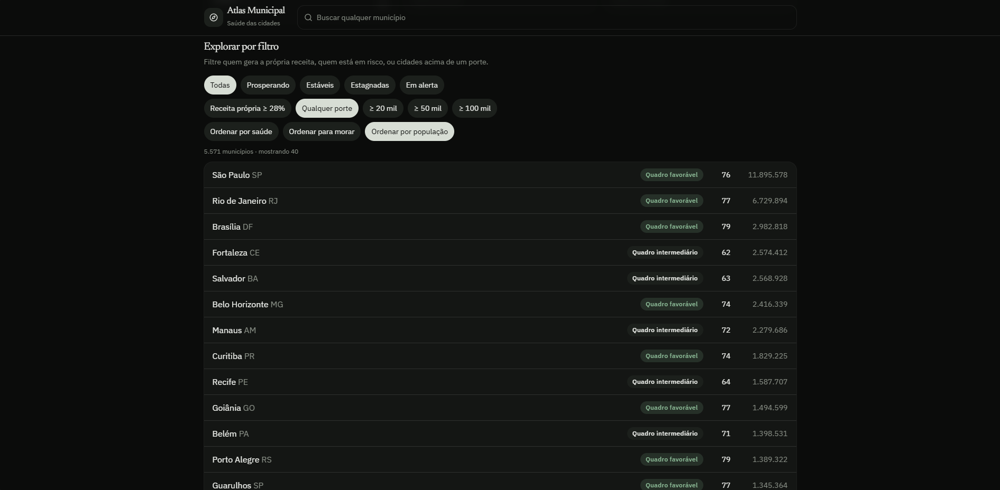 | 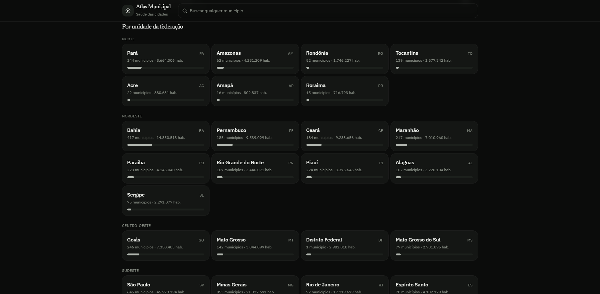 |
| **Explorar por filtro** — status, receita própria, porte e ordenação | **Por unidade da federação** — cartões por região com municípios e população |

### Raio-x da cidade

| | |
|---|---|
| 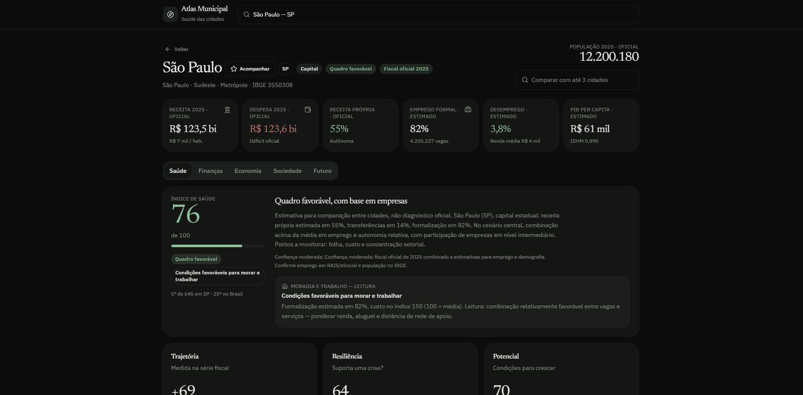 | 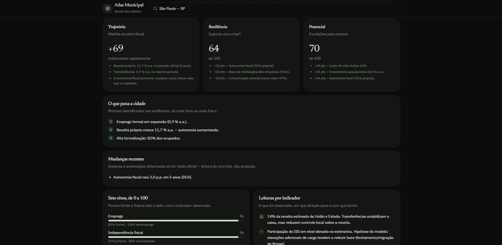 |
| **Cabeçalho** — KPIs oficiais, índice de saúde e as 5 abas | **Trajetória, resiliência, potencial**, motores da cidade e os sete eixos |
| 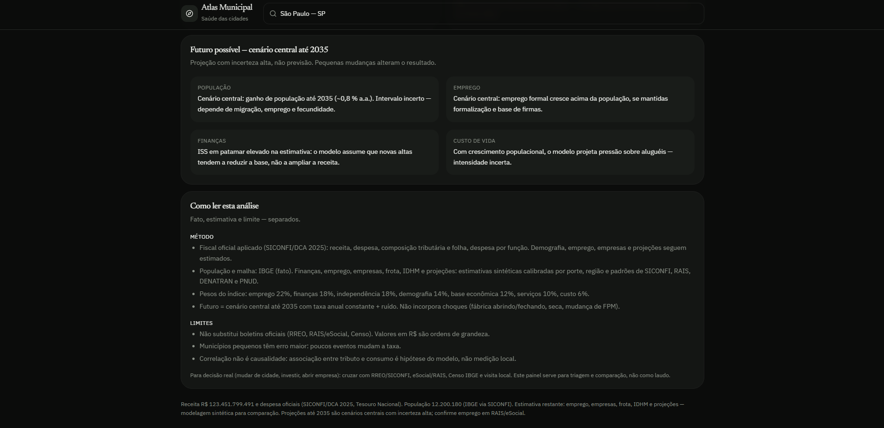 | 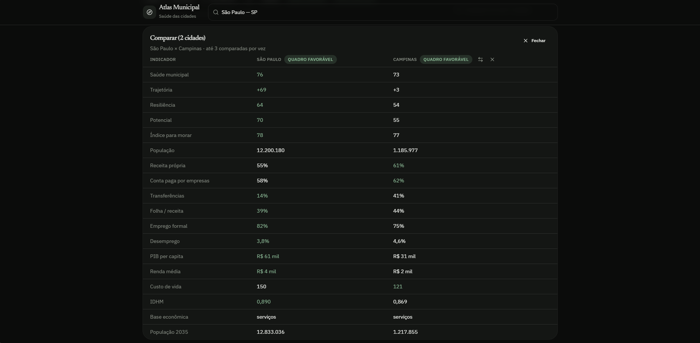 |
| **Leituras por indicador** — como ler cada medida e o que acompanhar | **Comparador** — até 3 cidades lado a lado, com troca e inversão |

### Abas do painel

| Finanças | Economia |
|---|---|
| 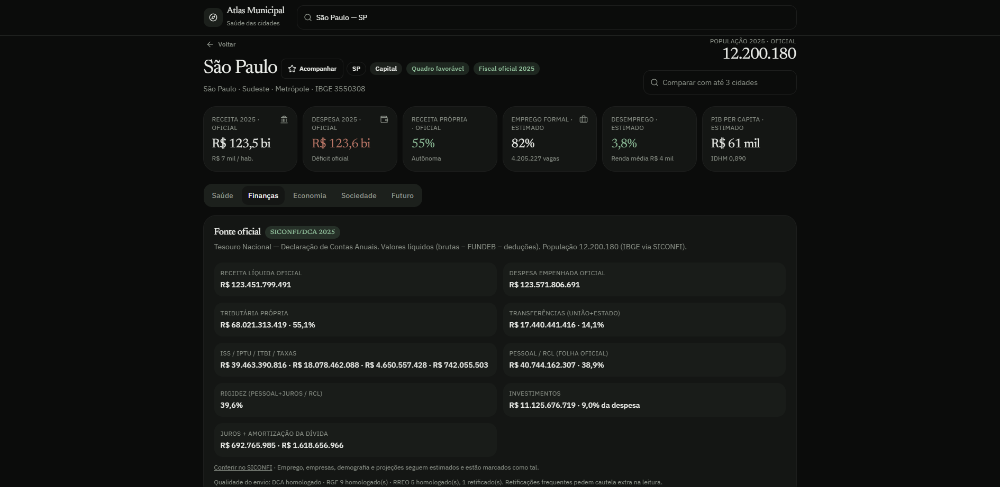 | 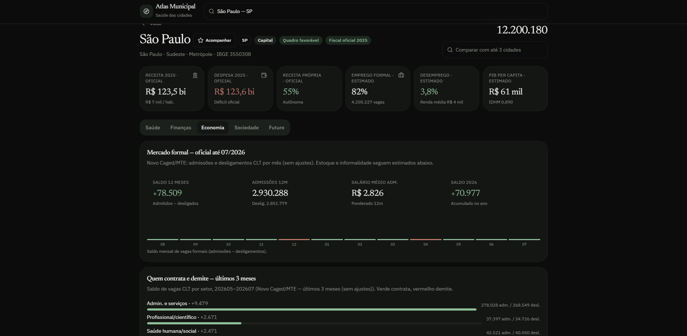 |
| **Fonte oficial** — SICONFI/DCA com valores brutos e qualidade do envio | **Mercado formal** — CAGED: saldo 12 meses, admissões e salário médio |
| 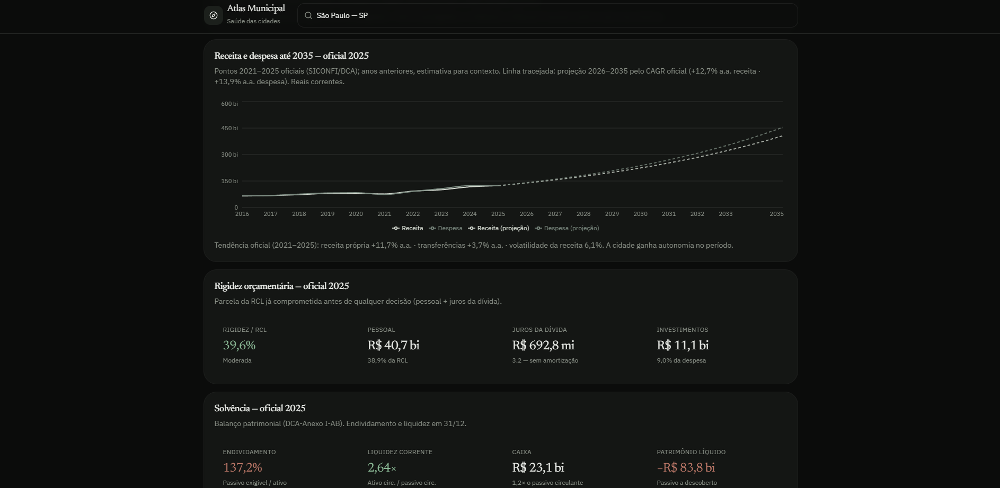 | 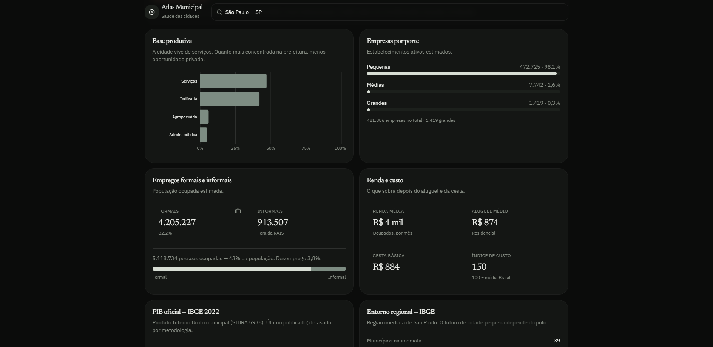 |
| **Série e rigidez** — receita/despesa desde 2011, LRF e balanço patrimonial | **Base produtiva** — PIB, renda, custo de vida e emprego por porte |
| 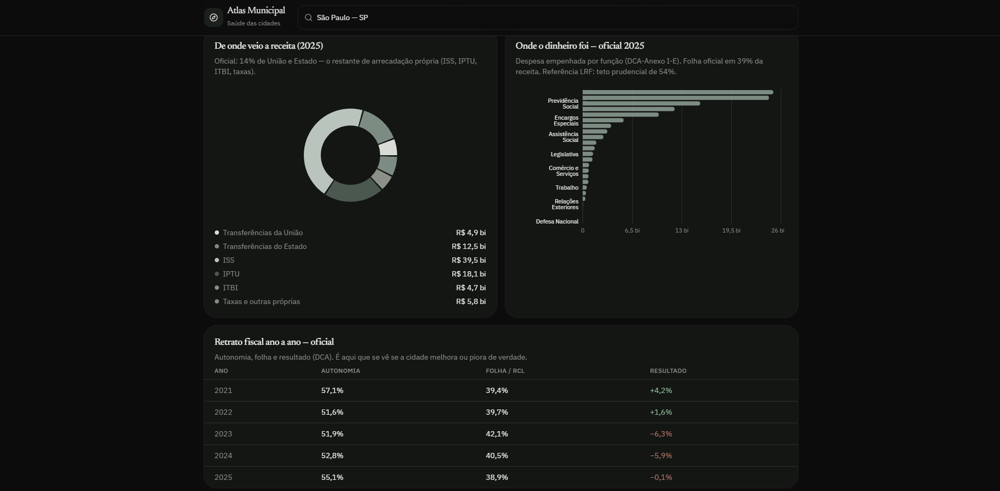 | 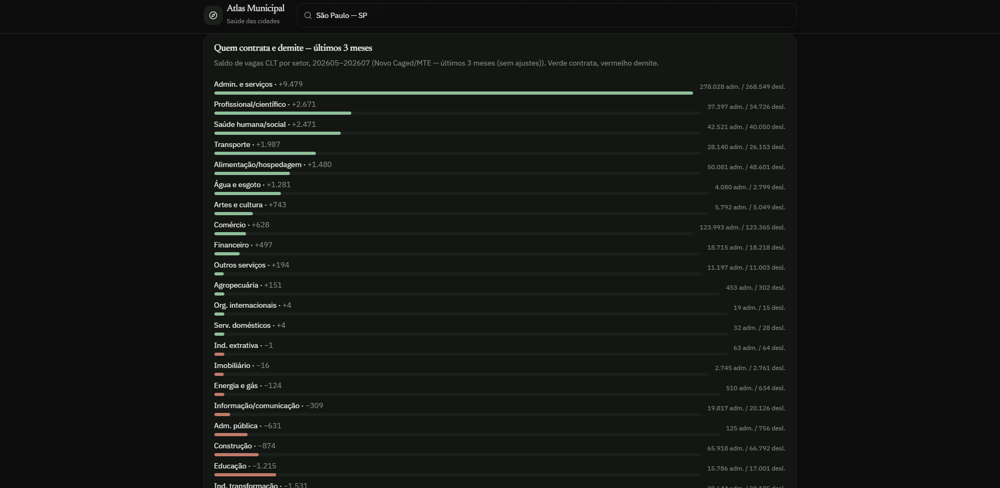 |
| **Origem da receita e funções da despesa** + retrato fiscal ano a ano | **Setores** — quem contrata e quem demite nos últimos meses |

| Sociedade | Futuro |
|---|---|
| 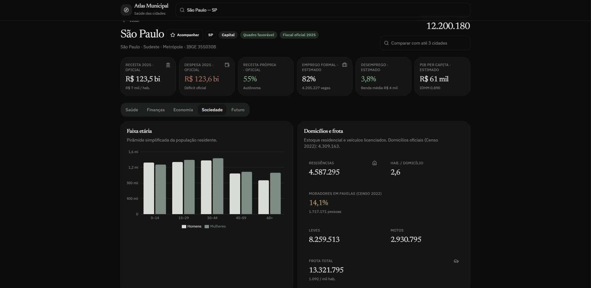 | 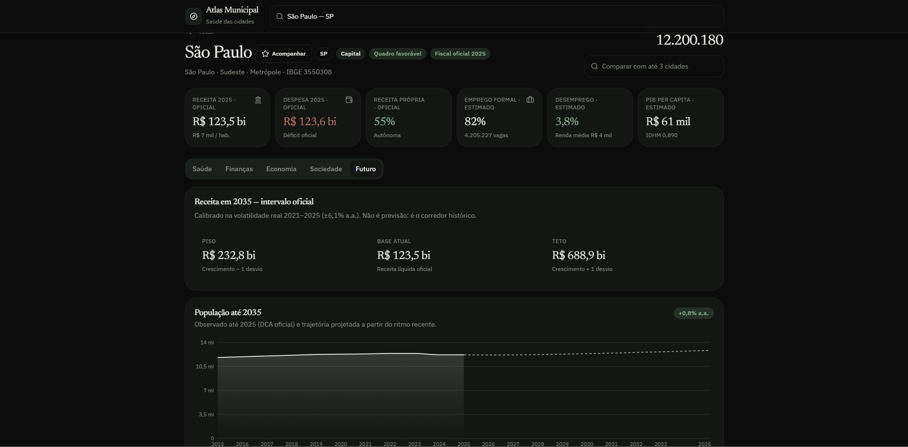 |
| **Faixa etária, domicílios e frota** | **Receita em 2035** — piso, base e teto calibrados na volatilidade oficial |
| 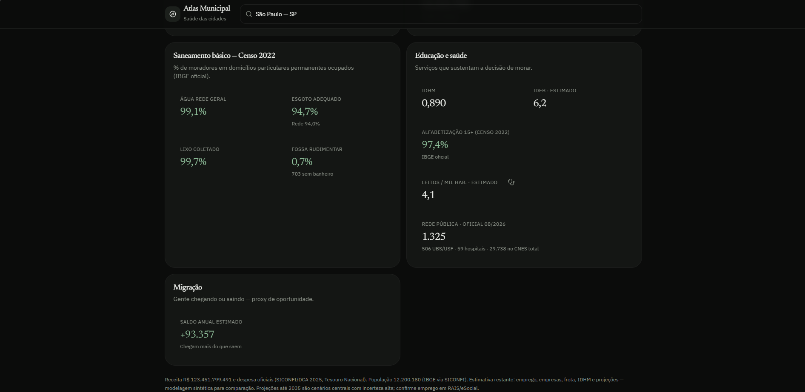 | 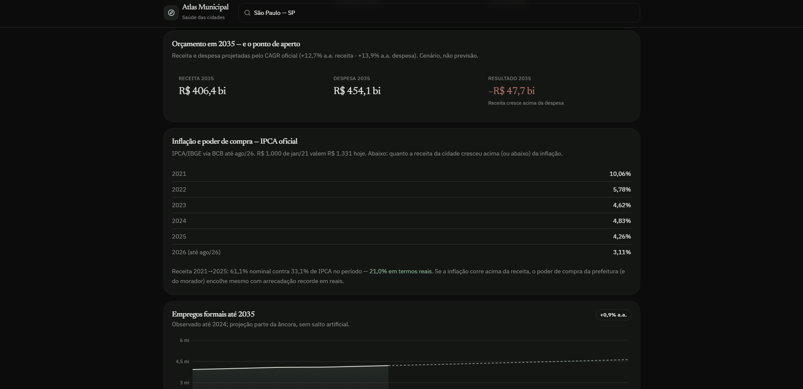 |
| **Saneamento (Censo 2022), educação, saúde e migração** | **Orçamento em 2035** — receita, despesa e resultado projetados |
| 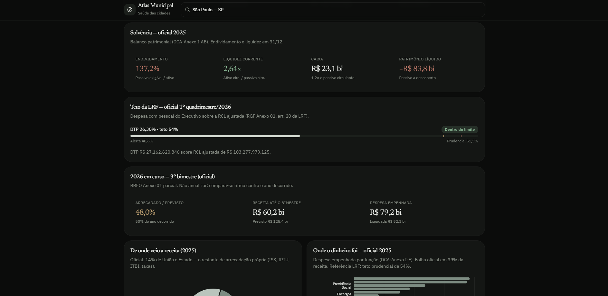 | 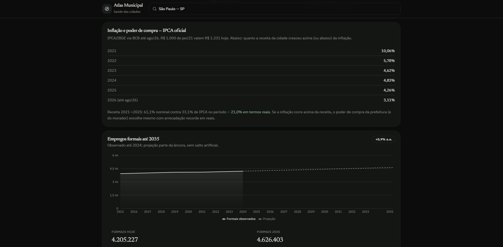 |
| **LRF e RREO** — teto de pessoal e execução do ano em curso | **Empregos formais até 2035** — projeção com faixa de incerteza |

---

## ✨ Funcionalidades

- **Busca nacional de municípios** — os 5.571 municípios por nome, UF ou código IBGE, com estado compartilhável na URL (`?cidade=3550308`).
- **Raio-x em 5 abas**:
  - **Saúde** — índice de saúde (0–100), quadro (favorável / intermediário / atenção), trajetória, resiliência, potencial, índice para morar, os sete eixos e leituras por indicador.
  - **Finanças** — receita/despesa oficiais (SICONFI/DCA), receita própria vs. transferências, rigidez, LRF/RREO, balanço patrimonial, série histórica com CAGR e volatilidade, origem da receita e funções da despesa.
  - **Economia** — CAGED (saldo 12 meses, admissões, desligamentos, salário médio), recorte por setor, base produtiva, PIB (IBGE), renda e custo de vida.
  - **Sociedade** — faixa etária, domicílios e frota, saneamento (Censo 2022), educação, saúde e migração.
  - **Futuro** — receita 2035 em intervalo oficial, orçamento projetado, população e empregos formais até 2035.
- **Comparador de até 3 cidades** (`?vs=id1,id2`) — tabela de indicadores com melhor valor destacado, troca, inversão e limpeza.
- **Watchlist local** — favorite cidades com "Acompanhar" (salvo em `localStorage`, sem cadastro).
- **Explorador inteligente** — "Encontre sua cidade ideal" ranqueia por 7 critérios (emprego formal, renda, custo-benefício, autonomia fiscal, crescimento, serviços/IDHM, solidez da folha) com filtros de porte e região, sempre mostrando o porquê de cada posição.
- **Exploração por filtro e por UF** — status (prosperando, estáveis, estagnadas, em alerta), receita própria mínima, porte, ordenação e visão por unidade da federação.
- **Transparência de dados** — cada número exibe ano/competência e fonte (`FonteDados`), com link para conferir no SICONFI; estado por camada: `loading | ready | empty | error`.
- **Cache inteligente** — consultas oficiais cacheadas no servidor (24h) e no navegador (7 dias), com fallback determinístico (`src/data/generate.ts`) enquanto o dado real não carrega.
- **Responsivo** — layout que funciona no notebook e no celular.

---

## 🛠️ Tecnologias

| Camada | Stack |
|---|---|
| **Frontend** | React 19, TanStack Router/Start, TanStack Query, TanStack Table, Tailwind CSS v4, Radix UI, Recharts, Lucide, zustand, zod |
| **Backend** | TanStack Start server functions, Nitro (preset Vercel) |
| **Dados** | PGLite (dev local) · Postgres/Neon (produção), Kysely, migrações SQL |
| **Fontes oficiais** | SICONFI/Tesouro (DCA, RGF, RREO), IBGE (Censo 2022, PIB, localidades), CAGED/MTE, CNES/DATASUS, Banco Central (IPCA) |
| **Ferramentas** | TypeScript 5.7, Vite 8, ESLint 9, Prettier, Playwright, scripts Python 3 (stdlib) para coleta |

---

## 📦 Instalação

**Pré-requisitos:** [Node 22](https://nodejs.org) (obrigatório) · Python 3 (opcional, só para baixar bases novas) · Git.

```bash
# 1. Clone o repositório
git clone https://github.com/leandro-25/Atlas_Municipal.git
cd Atlas_Municipal

# 2. Instale as dependências
npm install

# 3. Suba o app
npm run dev        # http://localhost:8080
```

Pronto: o banco embarcado (PGLite) sobe sozinho no primeiro `npm run dev` e aplica as migrações — não é preciso instalar Postgres.

---

## ⚙️ Configuração

### Variáveis de ambiente

| Variável | Onde | Obrigatória | Descrição |
|---|---|---|---|
| `DATABASE_URL` | servidor | Não (dev) / Sim (prod) | String de conexão do Postgres/Neon. Sem ela, o app usa PGLite local. |
| `VITE_AUTH_ENABLED` | build | Não | Habilita/desabilita o módulo de identidade (`true`/`false`). |

> **Nunca commite arquivos `.env`** — em produção as credenciais são injetadas pela plataforma. Apenas variáveis com prefixo `VITE_` chegam ao navegador.

### Camadas de dados (real + fallback)

| Camada | Origem | Como entra |
|---|---|---|
| Finanças, funções, patrimônio, RGF/RREO, série | **SICONFI / Tesouro (DCA)** — `src/lib/siconfi.ts` | server function ao vivo, cache 24h; anos tentados 2025 → 2024 → 2023 |
| Emprego formal | **CAGED / MTE** — `src/lib/caged.ts` | Postgres (`raw_caged`, `raw_caged_setor`) ou snapshot `src/data/caged*/<uf>.json` |
| PIB, entorno e demografia | **IBGE** | server function + `municipios.json` |
| Saneamento | **Censo 2022 / IBGE** — `src/lib/saneamento.ts` | tabela `raw_saneamento` ou snapshot `src/data/saneamento/<uf>.json` |
| Saúde (CNES) | **CNES/DATASUS** — `src/lib/saude.ts` | tabela `raw_saude` ou snapshot `src/data/saude/<uf>.json` |
| Inflação | **Banco Central (IPCA)** — `src/lib/inflacao.ts` | server function, cacheada |
| Fallback offline/demo | gerador determinístico `src/data/generate.ts` | enquanto o dado real ainda não carregou |

### Pipeline de carga de bases

```bash
python scripts/caged_fetch.py        && node scripts/caged_load.mjs         # CAGED
python scripts/caged_setor.py        && node scripts/caged_setor_load.mjs   # CAGED por setor
python scripts/censo_saneamento.py   && node scripts/saneamento_load.mjs    # Censo 2022
python scripts/cnes_fetch.py         && node scripts/saude_load.mjs         # CNES
npm run db:migrate                   # aplica migrations/*.sql
```

As migrações ficam em `migrations/` (`0002_caged`, `0003_saneamento`, `0004_saude`, `0005_caged_setor` + `auth/`) e são aplicadas automaticamente no dev e no build.

> **Aviso:** dados públicos têm defasagem própria (SICONFI, CAGED e CNES atualizam em ciclos diferentes). Valores per-capita usam a população/ano-base exibidos em tela — confira sempre ano e fonte antes de citar um número.

---

## 🚀 Como usar

### Rotas por URL

| URL | O que abre |
|---|---|
| `/` | Panorama nacional |
| `/?uf=SP` | Visão do estado |
| `/?cidade=3550308` | Raio-x de São Paulo |
| `/?cidade=3550308&vs=3106200,3304557` | Raio-x + comparador com Belo Horizonte e Rio |

### Comandos

| Comando | O que faz |
|---|---|
| `npm run dev` | Servidor de desenvolvimento em `http://localhost:8080` |
| `npm run build` | Build de produção + migrações |
| `npm run preview:restart` | Serve o build em `http://127.0.0.1:8081` |
| `npm run typecheck` | Verificação de tipos (`tsc --noEmit`) |
| `npm run lint` / `npm run format` | ESLint / Prettier |
| `npm run test` | Testes unitários |
| `npm run db:migrate` | Aplica as migrações do banco |

### Fluxo típico

1. Busque a cidade no topo (ou clique num estado no panorama).
2. Navegue pelas abas **Saúde → Finanças → Economia → Sociedade → Futuro**.
3. Toque em **Acompanhar** para guardar a cidade na sua lista local.
4. Use **Comparar com até 3 cidades** para montar o duelo — a URL vira um link compartilhável.

---

## 📁 Estrutura do projeto

```
Atlas_Municipal/
├── src/
│   ├── routes/
│   │   ├── __root.tsx           # shell do documento
│   │   └── index.tsx            # Home: busca, UF, dashboard, comparador
│   ├── components/
│   │   ├── city-dashboard.tsx   # abas Saúde/Finanças/Economia/Sociedade/Futuro
│   │   ├── city-compare.tsx     # comparador lado a lado
│   │   ├── city-search.tsx      # busca por município
│   │   ├── city-finder.tsx      # explorador "sua cidade ideal"
│   │   ├── national-overview.tsx # panorama, watchlist e filtros
│   │   ├── health-panel.tsx     # índices de saúde
│   │   ├── charts.tsx  kpi.tsx  score-bar.tsx  fonte-dados.tsx
│   │   └── ui/                  # primitivas Radix + Tailwind
│   ├── data/
│   │   ├── generate.ts          # fallback determinístico
│   │   ├── real.ts  use-real.ts # estados de cada camada de dado
│   │   ├── cities.ts  ufs.ts  municipios.json
│   │   └── caged/ caged_setor/ saneamento/ saude/   # snapshots por UF
│   ├── lib/
│   │   ├── siconfi.ts  caged.ts  saneamento.ts  saude.ts  inflacao.ts
│   │   ├── db.ts  watchlist.ts  auth/  app-data/
│   └── styles.css
├── scripts/                     # coleta (Python), carga, migrate, QA
├── migrations/                  # SQL versionado
├── img/                         # capturas de tela deste README
└── public/
```

---

## 🧪 Testes

```bash
npm run test        # testes unitários
npm run typecheck   # tipos
npm run lint        # estilo
```

- **Unitários** — `node --test` em `scripts/**/*.test.mjs` (migrações, preview, PWA, smoke/brand check) e suites TypeScript em `src/lib` (`app-data`, `gate-identity`, `sign-in-gate`).
- **Invariantes** — `npm run check:auth` valida o contrato de autenticação.
- **Navegador** — `node scripts/browser-smoke.mjs` sobe o app, audita desktop e mobile e reporta conteúdo visível + erros de console em JSON.

---

## 🚢 Deploy

O projeto está preparado para **Vercel** (preset `nitro` do TanStack Start):

1. Importe o repositório na Vercel (ou rode `vercel` na CLI).
2. Configure `DATABASE_URL` apontando para um **Postgres/Neon** — sem ela o build usa PGLite, que não é persistente em produção.
3. O build já roda `vite build` **e** `npm run db:migrate`.

```bash
npm run build          # build de produção + migrações
npm run preview:restart # confira o build servido em 127.0.0.1:8081
```

Ainda não há URL pública publicada — ao publicar, registre aqui o link da demo.

---

## 🗺️ Roadmap

- [ ] **RAIS/eSocial** para emprego e renda no lugar das estimativas atuais
- [ ] **Novas fontes**: mortalidade (SIM), nascimentos (SINASC), cobertura vacinal e leitos (CNES histórico)
- [ ] **Exportar relatório** em PDF/CSV do raio-x de uma cidade
- [ ] **App instalável (PWA)** com acesso offline ao último raio-x
- [ ] **Alertas de piora** fiscal/empregatícia nas cidades da watchlist
- [ ] **Testes E2E** com Playwright nos fluxos de busca e comparador
- [ ] **Séries por distrito/região metropolitana** onde a fonte permitir

---

## 🤝 Contribuindo

1. Faça um **fork** do repositório.
2. Crie uma branch: `git checkout -b feat/minha-melhoria`.
3. Faça suas alterações e mantenha o código consistente com o projeto.
4. Rode os checks: `npm run lint`, `npm run typecheck`, `npm run test`.
5. Abra um **Pull Request** descrevendo o quê e o porquê.

**Convenção de commits:** commits convencionais (`feat:`, `fix:`, `docs:`, `refactor:`) — como já usado no histórico.

Dúvidas, ideias ou erros encontrados? Abra uma [issue](https://github.com/leandro-25/Atlas_Municipal/issues).

---

## 📄 Licença

Distribuído sob a licença **MIT** — veja o arquivo [LICENSE](LICENSE) para detalhes.
